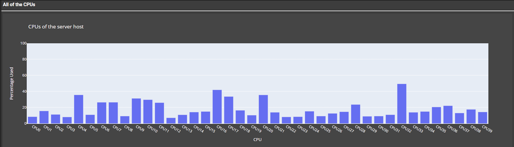
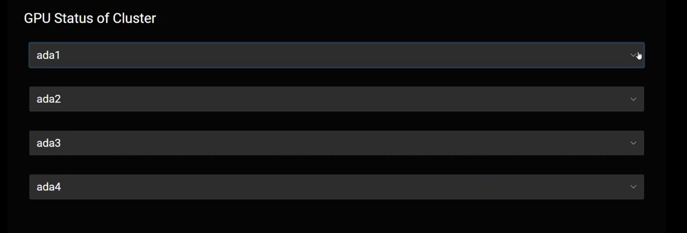

## Project Abstract

Machine learning is a data-driven model which requires user-given features. Deep Learning improves on that by removing user-given requirements, allowing the algorithm to assign features to itself.  Deep Learning models require a lot of computing power when trained and would need GPUs (Graphics Processing Unit) at the ready to train them. Users need a tool that they can use to check whether a GPU is available which is why the web server, “GPU status server", is created. Dash (Python framework for making dashboards) and Plotly (Graphic Engine of Dash) were used to develop the web server. The web server displays how many GPUs there are, checks whether they are available, and who is using them. It could also show additional information on specific analytics of the GPUs like memory, disk, and CPU (Central Processing Unit). These graphs give users more analytics on specific GPUs for their deep learning models. These graphs were implemented using Dash and Plotly as they allow fast and easy features on the web server. There have also been issues with users not appearing on the web server even though they are using the GPU. This bug was due to certain users having their names longer than eight characters. This was fixed by adding a new method in the code that accepts usernames longer than eight characters. In the future, an auto-refresh feature that does not need users to manually refresh the page, should be added. By adding additional features and bug fixes to the web server, the deep learning team is provided a more informational look at GPU availability for each server host. 

## Project Contribution 1: Fixing missing users

There were some users that were not appearing on the web server even though they are using the GPU's. This was mainly caused because of a line of code, "ps aux" which shortens the username by 8 characters. If users are longer than 8 characters, they have a + at the end. When that user with the + at the end is called by a second line of code using "id -nu (user with a +)", the user cannot be found.

How this was fixed is by using a different line of code which was "Ps axo user:20,pid | grep (pid)" instead. This line of code grabs all the users and their pid with the addition of printing out users longer than 10 characters. Once this is called by the same second line of code "id -nu", it was able to successfully print out all the users.

## Project Contribution 2: Adding Display features

The webserver before only showed who was using the gpu, the status of the gpu, and what gpu it was specifically. There could be more features added onto the web server providing more information for the deep learning team. What my mentor wanted on the webserver for the deep learning team was display of disk, memory, and CPUs. 

How this was made was through plotly and DASH. Using these two tools allowed more graphs and information to be implemented onto the webserver. 

## Project Contribution 3: Layout Change

The web server needed a layout redesign due to how big the graphs are on the web server display. This would cause the deep learning team to take up more time to find if a GPU is available than necessary. By changing the layout to an accordion collapse, the team can find the server hosts that they want to check on without scrolling through the whole web server.

## Reflection

I have learned a lot from this project whether it would be learning how to use the DASH framework of python, understanding how the website is maintained, and how to manage my time with the amount given.

## Progress and Presentation

Here is my [Presentation](https://docs.google.com/presentation/d/1yPRs8vxF040HdUPke632nkWaMuBigXCOH5ZVoUWNmzE/edit?usp=sharing) that I presented at my internship
